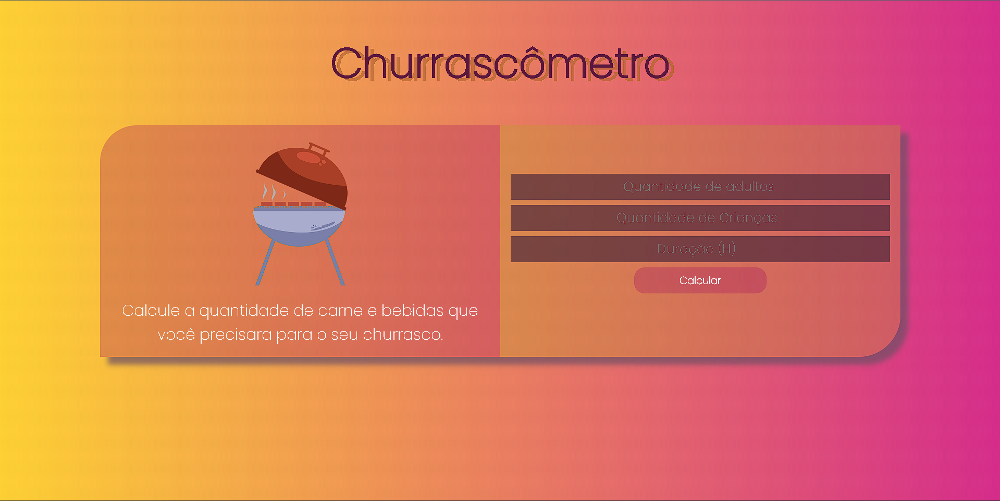

# Churrascometro

Projeto desenvolvido no curso do ProgramadorBR.

  
 # 💻Sobre: 

  Este projeto tem como objetivo calcular a quantidade de comida e bebida necessária para um churrasco baseado nas seguintes informações:

<ul>
  <li>
    Carne = 400gr por pessoa + de 6horas = 650gr
  </li>
  <li>
    Cerveja = 1200ml por Pessoa + 6 horas = 2000ml
  </li>
  <li>
    Refrigerante/água = 1000ml por pessoa + 6 horas = 1500ml
  </li>
</ul>

Obs: Crianças valem por 0,5.
